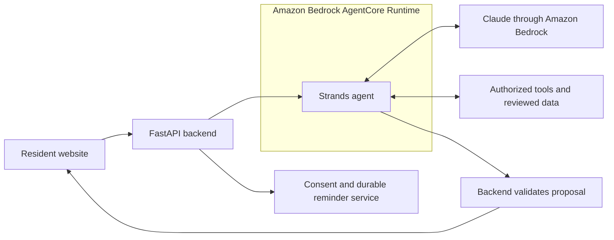

# How AgentCore and Strands Work Together

FoodShare Bridge in plain English

September 8, 2026 | Version 1.0

## 1 The decision

FoodShare Bridge will run its Strands agents on Amazon Bedrock AgentCore Runtime. This is now a project requirement. The website and application backend remain separate. This document explains the planned deployment; no cloud resources have been deployed by this update.

## 2 What each part does

| Part | Plain English role | FoodShare Bridge example |
| --- | --- | --- |
| Website | The screens a resident uses | Ask for food this week, confirm a notice date or review a plan |
| FastAPI application backend | Checks the request and controls access and actions | Confirm which session owns a document and whether sharing was approved |
| Strands | The code that organizes the agent's work with the model and tools | Look up approved guidance, inspect pantry options and propose the next step |
| Claude through Bedrock | The AI model that interprets information and generates proposals | Explain notice language or suggest a plan using retrieved evidence |
| AgentCore Runtime | The managed AWS service where our Strands code runs | Start and run the agent in an isolated session and return its result |
| Our tools and database | The agent's permitted access to evidence and calculations | Read verified service hours, calculate logged hours and preserve plan versions |

We write the prompts, tools and workflow behavior with Strands, then deploy that Python application to AgentCore. AgentCore handles the execution environment and scaling. It does not supply FoodShare knowledge or replace the model. [Strands deployment guide](https://strandsagents.com/docs/user-guide/deploy/deploy_to_bedrock_agentcore/python/), [AWS Runtime overview](https://docs.aws.amazon.com/bedrock-agentcore/latest/devguide/runtime-how-it-works.html).

## 3 A resident request from start to finish

Suppose Maria selects a synthetic notice in the demonstration and asks, “What should I do, and where can I get food this week?”

1. **The website collects the request.** Maria selects a language, confirms the notice facts and provides only the food-planning details that matter.
2. **Our backend checks access.** It identifies Maria's anonymous session, loads permitted records and chooses the appropriate workflow. It sends a limited request to AgentCore using the backend's AWS permissions.
3. **AgentCore runs our Strands code.** The backend maps Maria's session to a separate runtime session. Residents do not need AWS accounts or AWS credentials.
4. **Strands works with Claude and our tools.** The model can request approved policy passages and local food resources. Our tools retrieve records and check practical constraints. The agent proposes an explanation, official contact route and seven-day plan with any gaps visible.
5. **Our backend checks the proposal.** It verifies evidence, dates, ownership and food-plan constraints before showing the result. AgentCore isolation does not replace these checks.
6. **Maria chooses the next action.** Downloading a packet, asking for a reminder and sharing details have distinct controls. A reminder is delivered later by the scheduler and delivery worker after consent checks; a running agent session is not the reminder clock.

This is a proposed request flow, not evidence of a deployed integration. The backend's ownership and consent checks apply to every request, even if the runtime session is already active.

## 4 Why use AgentCore here

AgentCore gives us a managed place to run the agent as people use the website. AWS documents isolated runtime sessions, authenticated invocation, versioned deployments and streaming responses. These capabilities support separate household conversations and controlled updates to our agent code. [Runtime capabilities](https://docs.aws.amazon.com/bedrock-agentcore/latest/devguide/runtime-how-it-works.html).

Our team still supplies accurate sources, permissions, prompt evaluation and application safeguards. A protected execution environment cannot make a stale pantry listing current or determine whether a resident's exemption has been approved.

## 5 What happens to saved plans

A runtime session is temporary working space. Store approved business records, plan versions, consent and delivery receipts in DynamoDB, and authorized files in private S3 storage. If the runtime ends, the application can start another invocation using records it is still allowed to retain. It must not infer a previous approval from a remembered conversation. AWS explicitly describes runtime session state as ephemeral. [Runtime sessions](https://docs.aws.amazon.com/bedrock-agentcore/latest/devguide/runtime-how-it-works.html).

The backend creates and verifies the mapping between a resident session and an AgentCore session. Knowing a runtime identifier does not grant access to a household. Tool services enforce the document and record permissions independently.

## 6 What we use first

Use **AgentCore Runtime** for the resident Strands agent and a separate runtime configuration for maintenance analysis. Maintenance gets public-source permissions only and cannot access resident files or send messages. Use IAM-authenticated backend calls and minimal telemetry with sensitive payload capture disabled.

AgentCore also has additional services, including Memory and Gateway. They are not prerequisites for this design. We will use application-owned records for persistence and directly registered Strands tools first. Add another AgentCore service only when a concrete requirement justifies it.

Fargate continues hosting FastAPI and any non-agent processing workers. It no longer hosts the Strands model loop in the planned deployment. Transcribe and Polly continue handling optional speech; the reminder system continues using Scheduler, SQS, Lambda and the SMS provider.

## 7 Evidence needed before claiming completion

The implementation must demonstrate a real website request invoking the deployed runtime, a Strands tool call, a validated response, isolated household sessions and recovery after runtime termination. It must also show that maintenance cannot access resident documents and that cancelled or replayed requests cannot produce unauthorized delivery. Pin the runtime deployment version, SDK, model, prompt and tool versions together and test rollback.
